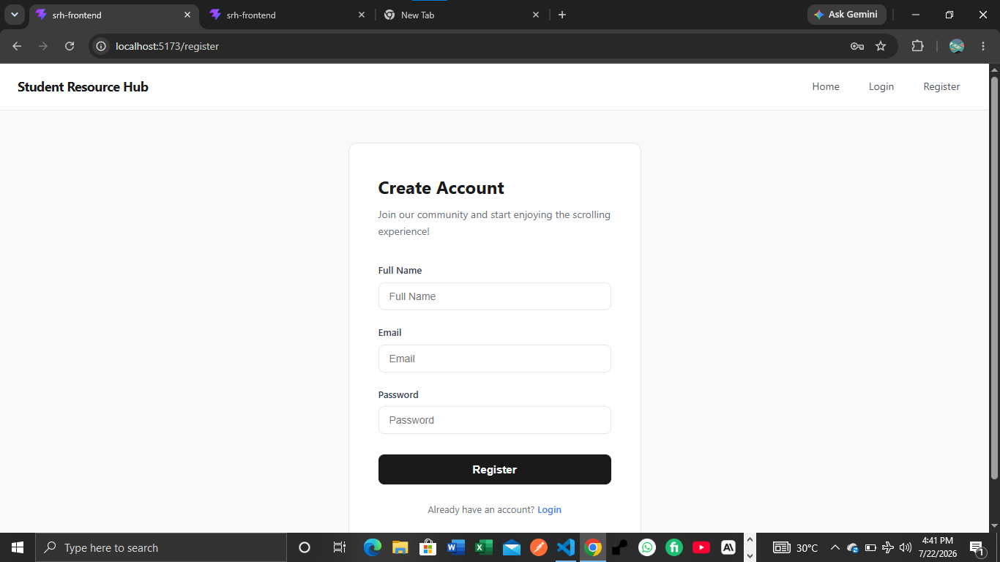
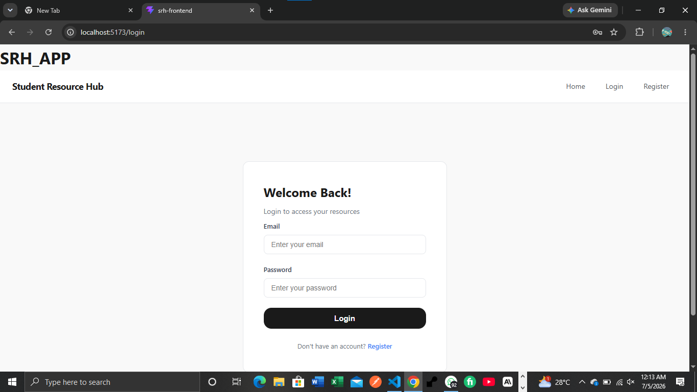
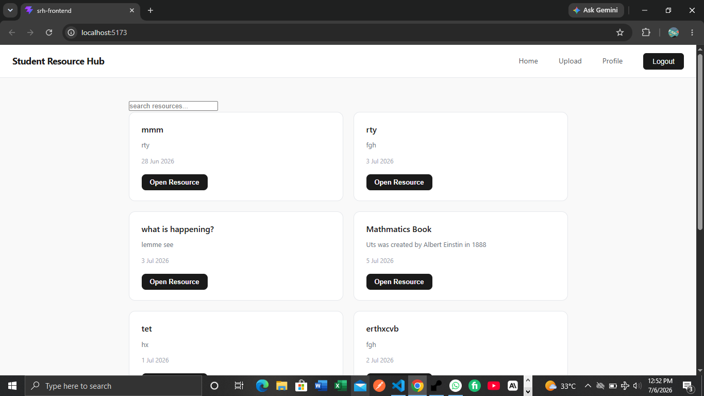
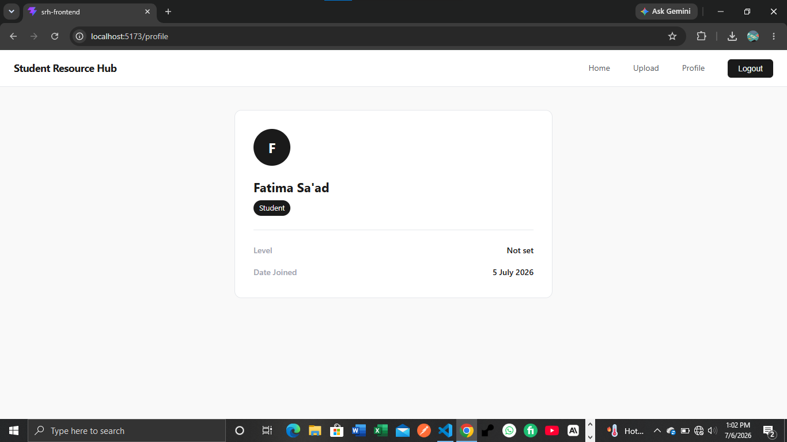
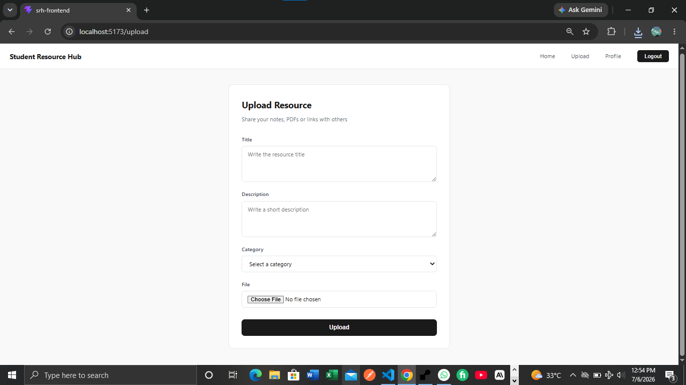
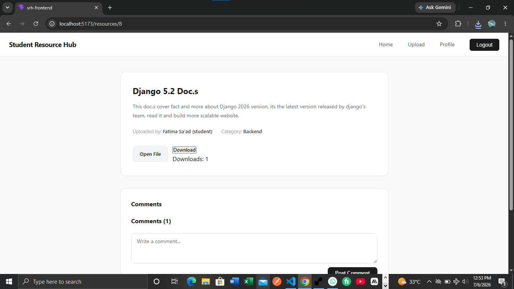

# Student Resource Hub

A full-stack web application where students and lecturers can upload, browse, search, and download academic resources.

**Live Demo:** https://srh-frontend.vercel.app  
**Backend API:** https://student-resource-hub-qx57.onrender.com  
**Hire me:** https://fiverr.com/s/Q78QpXP

---

## What it does

- Students and lecturers register and login with JWT authentication, selecting their Faculty, Department, and Level at registration
- Browse and search academic resources by title
- Upload resources (PDFs, images, or links) with category and description
- New uploads go through a moderation queue and require approval before appearing publicly
- Download resources with a download counter
- Rate resources (1–5 stars) and comment on them
- Edit or delete your own resources
- See every resource you've uploaded on your profile page
- Auth-aware navigation — guests see different links from logged-in users
- Protected routes — upload, comment, rate, and download require authentication
- User profile page showing name, role, faculty, department, level, and join date
- Persistent top + bottom navigation (Home, Search, Upload, Profile) that stays visible while scrolling
- Full dark / light / system theme support

---

## Tech Stack

**Frontend**
- React 18 (Vite)
- React Router v6
- Context API for global auth and theme state
- Custom hooks
- Plain CSS with CSS variables for theming

**Backend**
- Django 5.2
- Django REST Framework
- Simple JWT authentication
- PostgreSQL
- Cloudinary (file storage)
- Deployed on Render

---

## Project Structure

```text
src/
├── api.js
├── context/
│   ├── AuthContext.jsx
│   └── ThemeContext.jsx
├── hooks/
│   └── useFetch.js
└── components/
    ├── Navbar.jsx
    ├── Layout.jsx
    ├── ResourceCard.jsx
    ├── ResourceDetail.jsx
    ├── ResourceList.jsx
    ├── LoginForm.jsx
    ├── RegisterForm.jsx
    ├── UploadForm.jsx
    ├── EditResource.jsx
    ├── Profile.jsx
    ├── Comments.jsx
    ├── Rating.jsx
    ├── PendingSubmissions.jsx
    └── DownloadResource.jsx
```


## Registration Page
<p align="center">
    
</p>


## Login Page
<p align="center">
    
</p>


## Resources List Page
<p align="center">
    
</p>


## Profile Page
<p align="center">
    
</p>

## Upload Resource Page
<p align="center">
    
</p>


## Resource Details Page
<p align="center">
    
</p>

## Pending Submissions (Moderator) Page
<p align="center">
    
</p>

## Dark Mode
<p align="center">
    
</p>

## Running Locally

```bash
# Install dependencies
npm install

# Create .env file
VITE_API_URL=http://127.0.0.1:8000/api

# Start development server
npm run dev
```

## Backend Repository
Django REST Framework API → [student-resource-hub](https://github.com/Houzsaad/student-resource-hub)

## Features in Progress
- Password reset (researching a reliable email/OTP provider)
- Multiple image upload per resource (1–4 images) — planned for a future version
- Progressive Web App (PWA) support
- Custom domain

## Author
Huzaifa Sa'ad

Self-taught fullstack developer — Django + React

📧 houzsaad@gmail.com  
🐙 github.com/Houzsaad  
💼 fiverr.com/s/Q78QpXP